# Vehicle Tracker

[](https://flutter.dev)
[](https://dart.dev)
[](https://firebase.google.com)
[](https://firebase.google.com/products/firestore)
[](https://pub.dev/packages/go_router)
[](https://pub.dev/packages/dio)
[](https://pub.dev/packages/geolocator)
[](https://pub.dev/packages/geocoding)
[](https://pub.dev/packages/image_picker)
[](https://pub.dev/packages/weather)
[](https://www.cloudflare.com)

Aplicativo Flutter para gerenciamento de frota com autenticação, garagem, roteiros, clima e perfil.

## 🚀 Visão Geral

`Vehicle Tracker` é um projeto cross-platform criado em Flutter com uma experiência de gestão de frota muito visual e funcional. O app usa Firebase para autenticação e armazenamento, FIPE para busca de marcas e modelos de veículos, OpenWeather para informações de clima, geolocalização para auto-preenchimento de origem e um fluxo de viagens com histórico.

## ✨ Funcionalidades Principais

- Autenticação com e-mail e senha usando Firebase Auth
- Cadastro de usuário com perfil e avatar customizado
- Dashboard com clima atual e veículo em roteamento
- Garagem com lista de veículos, busca e filtro
- Adição de veículos com pesquisa de marca/modelo/ano via API FIPE
- Criação de viagens com origem, destino, distância e seleção de veículo
- Histórico de viagens com filtros por status
- Tema claro/escuro com mudança em tempo real
- Upload de avatar via Cloudflare R2

## 🧱 Arquitetura do Projeto

O projeto segue uma arquitetura em camadas com divisão clara entre:

- `lib/main.dart` – inicialização do Firebase e injeção de dependências
- `lib/vehicle_tracker_app.dart` – configuração do `MaterialApp.router`
- `lib/src/core/` – rotas, temas, injeção de dependências, serviços e widgets compartilhados
- `lib/src/features/` – recursos da aplicação separados por domínio:
  - `auth`
  - `dashboard`
  - `garage`
  - `profile`
  - `trip`
- `test/` – suíte de testes unitários e widget tests

## 🛠️ Pilha Tecnológica

- Flutter
- Dart
- Firebase Auth
- Cloud Firestore
- GoRouter
- Ionex
- Dio
- Weather
- Geolocator
- Geocoding
- Image Picker
- Cloudflare Storage Service
- Fake Cloud Firestore e Firebase Auth Mocks para testes

## ▶️ Como Executar

### ✅ Pré-requisitos

- Flutter instalado e configurado
- SDK compatível com Dart >= `3.11.1`
- Dispositivo/emulador Android ou iOS configurado
- Configuração Firebase válida para a plataforma alvo

### 📦 Instalação

```bash
git clone https://github.com/BrenoLeiriaoNeto/vehicle_tracker.git
cd vehicle_tracker
flutter pub get
```

### 🏃 Executar o app

```bash
flutter run
```

Para rodar em um dispositivo específico:

```bash
flutter run -d <device_id>
```

## ☁️ Configuração do Firebase

O app já depende de Firebase para autenticação, Firestore e perfil de usuário.

- Android: `android/app/google-services.json`
- iOS/macOS: adicione `GoogleService-Info.plist` se necessário
- Web: configure `DefaultFirebaseOptions.web` em `lib/src/core/services/firebase_options.dart`

> Se estiver usando Firebase local ou outro projeto, ajuste os arquivos de configuração e crie as coleções `users`, `garage` e `trips` no Firestore.

## Uso do App

### Fluxo principal

1. Faça login ou crie sua conta.
2. Navegue pelo `Dashboard` para ver o clima e viagens em andamento.
3. Adicione veículos à garagem usando a pesquisa de marca/modelo/ano.
4. Crie viagens definindo origem, destino e distância.
5. Atualize seu perfil, incluindo foto e biografia.

### Telas principais

- `Autenticação` – login e cadastro com animação de flip
- `Dashboard` – clima e viagem ativa
- `Garagem` – lista de veículos e busca inteligente
- `Nova Viagem` – rota, distância e veículo selecionado
- `Perfil` – edição de avatar e métricas pessoais

## 🧪 Testes

A base de testes está disponível em `test/`.

Executar todos os testes:

```bash
flutter test
```

## 🖼️ Passo a passo por imagens

Siga os passos abaixo para entender a navegação do App.

1. **Tela inicial**
   - **Descrição**: Primeira tela ao iniciar o app, permitindo fazer login em uma conta ja existente ou navegar para o formulário de criação de nova conta. Vamos presionar o link _Cadastre-se_ no rodapé da tela para chegarmos na tela de criação de nova conta. Ao chegar na tela de criação, preencha os campos e pressione o botão _Cadastrar_. Isso irá criar sua conta e imediatamente logar você no sistema, navegando para a tela Dashboard.

   <p align="center">
    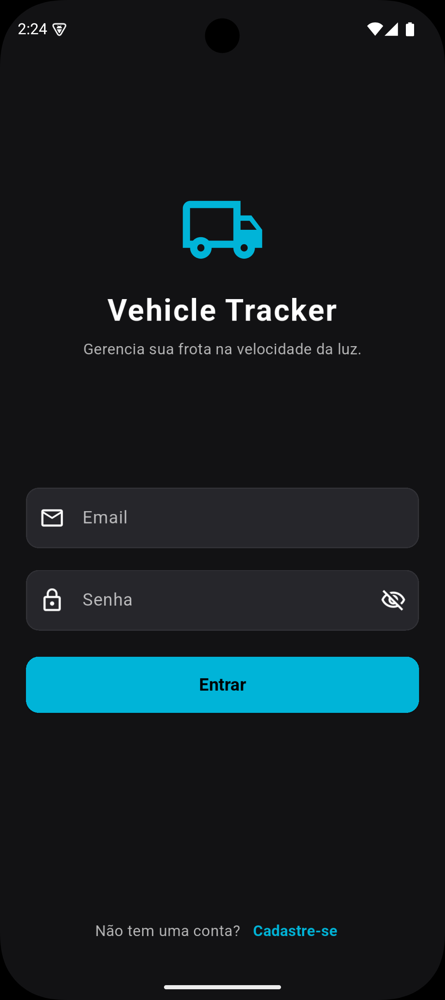&nbsp;&nbsp;&nbsp;&nbsp;
    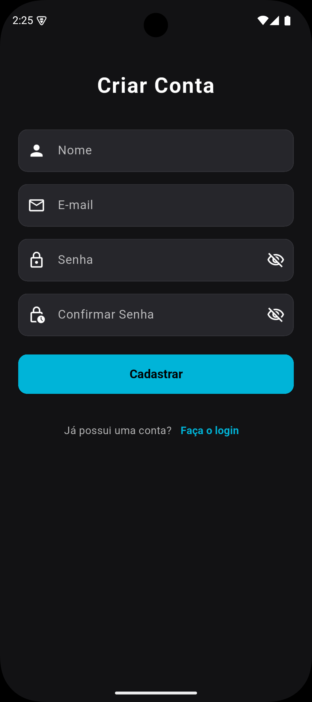&nbsp;&nbsp;&nbsp;&nbsp;
    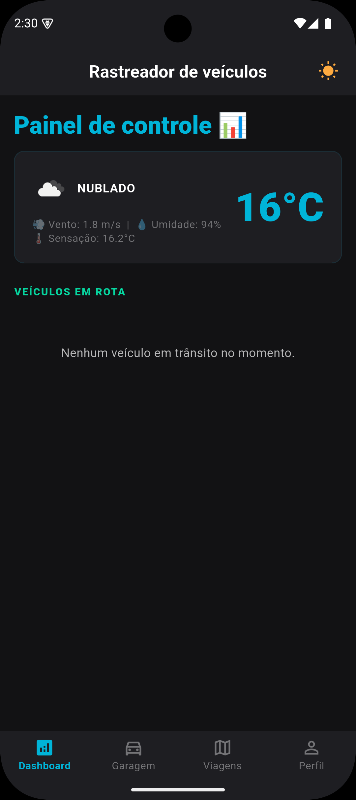&nbsp;&nbsp;&nbsp;&nbsp;
   </p>

   ***

2. **Dashboard com clima e viagem ativa**
   - **Descrição**: Esta é a nossa primeira tela do app. Aqui temos acesso a informações atuais do clima e uma listagem de viagens ativas no momento. A listagem de viagens será demonstrada em outra sessão. Também é possível ver a navegação de telas por uma barra no rodapé da tela, bem como trocar de temas dark e light no canto superior direito da tela, no ícone de sol.

   <p align="center">
   
   </p>

   ***

3. **Gerenciamento da garagem**
   - **Descrição**: Ao presionar na aba de _Garagem_, com ícone de carrinho, na barra de navegação do rodapé, iremos navegar para a tela de listagem de carros da aplicação. Ao clicar no botão `+` no canto inferior direito da tela, iremos navegar para a tela de adição de um novo veículo a garagem. Selecionamos primeiro a marca do veículo, depois selecionamos o modelo e então o ano/combustível. Preenchemos então a placa, a quiloemtragem atual do veículo e pressionamos o botão _Salvar veículo_ para adicionarmos a nossa garagem. Seremos então navegados de volta para a tela de listagem de veículos, agora com o novo veículo adicionado, basta usar o campo de pesquisa no topo da tela para pesquisar pelo veículo através de sua marca, modelo ou placa.
   - **Observação**: O aplicativo busca uma listagem externa da FIPE, então haverá marcas de veículos que podem não possuir modelos disponíveis para adicionar no app.

   <p align="center">
   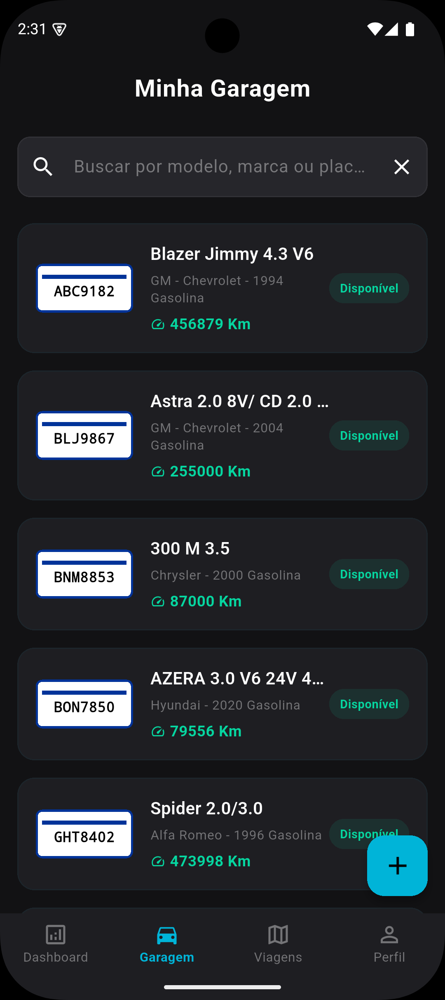&nbsp;&nbsp;&nbsp;&nbsp;
   &nbsp;&nbsp;&nbsp;&nbsp;
   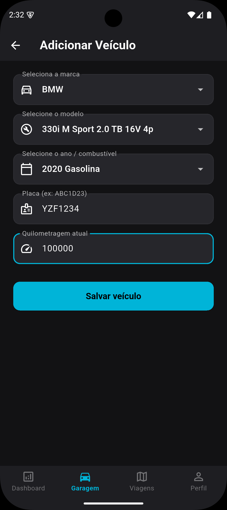&nbsp;&nbsp;&nbsp;&nbsp;
   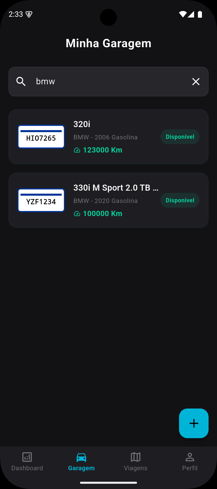&nbsp;&nbsp;&nbsp;&nbsp;
   </p>

   ***

4. **Tela de Perfil**
   - **Descrição**: Ao pressionar na aba de _Perfil_, com ícone de usuário, na barra de navegação do rodapé, seremos navegados para a tela de perfil do usuário. Na tela de perfil, podemos ver o avatar do usuário, função de edição de perfil e métricas do usuário no uso do app, que se resumem em Viagens completadas e Km Rodados, e o botão de logout no canto superior direito da tela. Ao pressionar no botão _Editar Perfil_, seremos levados a tela de edição do perfil. A edição de perfil será dividida em 3 subsessões, pois temos 3 formas diferentes de adicionarmos um novo avatar para o perfil, sendo eles: Câmera, Galeria e URL direta (suporte apenas aos formatos jpg, jpeg, png e svg).
     - **_Câmera_**: Na tela de edição de perfil, preencha o campo _Biografia_ com alguma informação sobre você e depois pressione o botão _Câmera_ para abrir a câmera do seu dispositivo para tirar uma foto (o app precisará da sua permissão para isso). Ao tirar a foto, aguarde até o avatar na tela de edição carregar a imagem e pressione o botão _Salvar Alterações_. Seremos levados devolta para a tela de perfil, agora com biografia e avatar atualizados.
      <p align="center">
         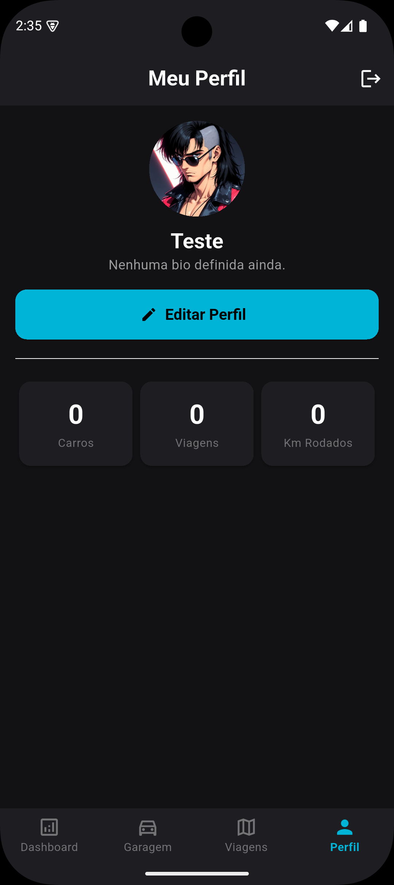&nbsp;&nbsp;&nbsp;&nbsp;
         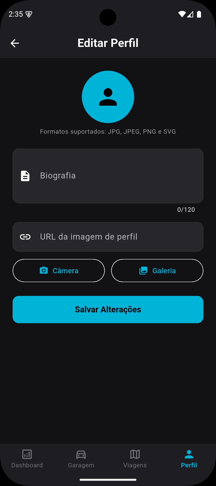&nbsp;&nbsp;&nbsp;&nbsp;
         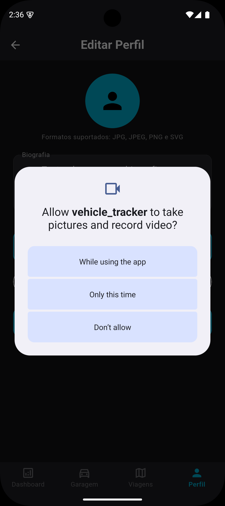&nbsp;&nbsp;&nbsp;&nbsp;
         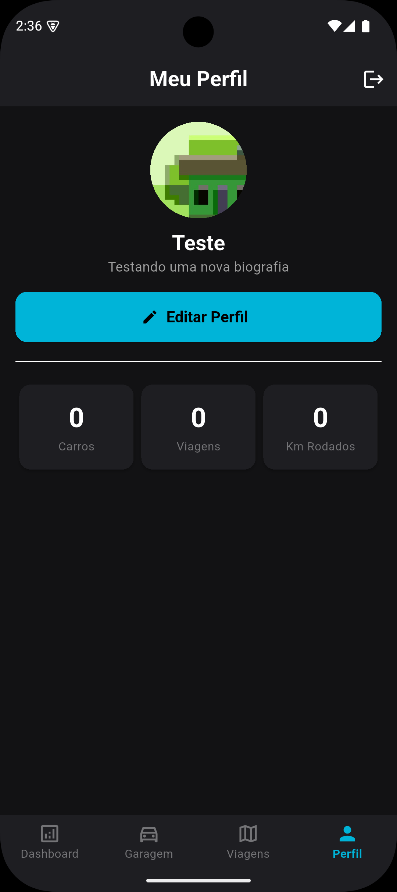&nbsp;&nbsp;&nbsp;&nbsp;
     </p>

     - _Galeria_: Na tela de edição de perfil, altere o campo _Biografia_ com alguma informação sobre você e depois pressione o botão _Galeria_ para abrir a galeria do seu dispositivo para selecionar uma imagem. Ao selecionar a imagem, aguarde até o avatar na tela de edição carregar a imagem e pressione o botão _Salvar Alterações_. Seremos levados devolta para a tela de perfil, agora com biografia e avatar atualizados.
      <p align="center">
         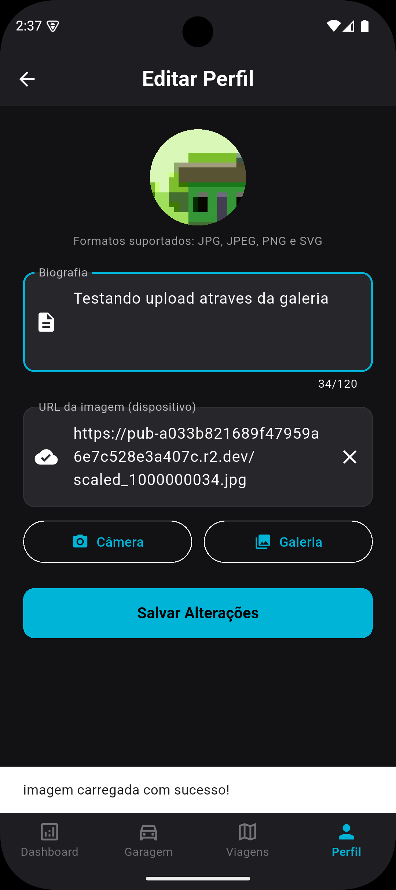&nbsp;&nbsp;&nbsp;&nbsp;
         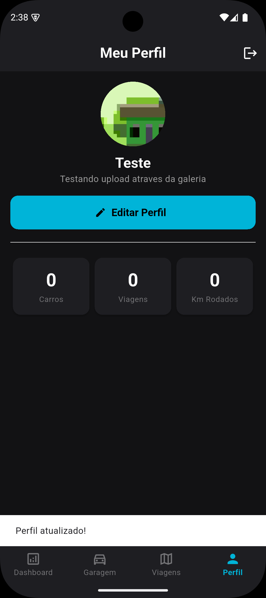&nbsp;&nbsp;&nbsp;&nbsp;
     </p>

     - _URL direta_: Na tela de edição de perfil, altere o campo _Biografia_ com alguma informação sobre você e depois preencha o campo _URL da imagem_ com alguma URL de imagem externa como: `https://picsum.photos/200/300.jpg`. Ao colar a URL da imagem, aguarde até o avatar na tela de edição carregar a imagem e pressione o botão _Salvar Alterações_. Seremos levados devolta para a tela de perfil, agora com biografia e avatar atualizados.
      <p align="center">
         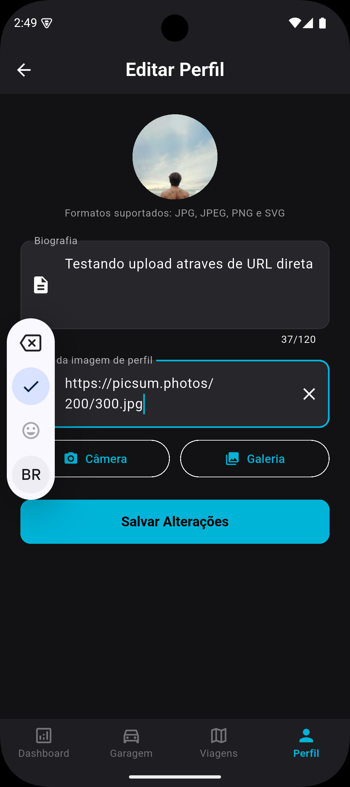&nbsp;&nbsp;&nbsp;&nbsp;
         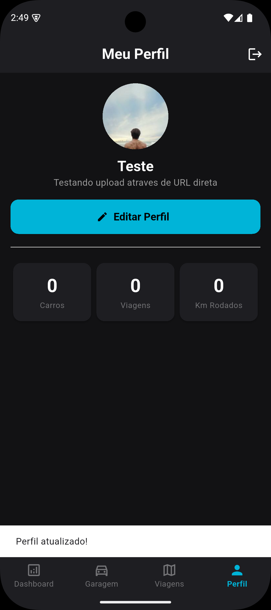&nbsp;&nbsp;&nbsp;&nbsp;
     </p>

     ***

5. **Gerenciamento de viagens**
   - **Descrição**: Ao pressionar na aba de _Viagens_, com ícone de mapa, na barra de navegação do rodapé, seremos navegados até a tela de listagem de viagens. Nesta tela, temos acesso aos filtros de viagem no topo da tela, botão de atualizar a lista no canto superior direito e o botão de configurar uma nova viagem, no canto inferiror direito. Vamos pressionar o botão de configurar uma nova viagem. Nesta nova tela, selecionamos um veículo disponível em nossa garagem, preenchemos o ponto de origem de forma manual ou com GPS, apenas pressionando no ícone a direita do campo de texto, preenchemos o ponto de destino, especificamos a distância estimada da viagem e pressionamos o botão _Criar e iniciar viagem_. Ao pressionar o botão, seremos levados de volta para a tela de listagem de viagem, agora listando a nossa nova viagem. Para vermos a viagem acontecendo, pressionamos na aba _Dashboard_, na navegação do rodapé, e podemos ver que agora a tela da Dashboard tem um card com informações sobre a viagem em progresso. A viagem atualiza o progresso a cada 5 segundos e, após finalizar, irá sumir da tela da Dashboard. Pressionamos novamente a aba _Viagens_, na navegação do rodapé, para voltarmos para a tela de listagem de viagens, pressionamos o botão de atualizar lista no canto superior direito, e vamos ter a nossa viagem com o status atualizado para _Concluída_.

   <p align="center">
    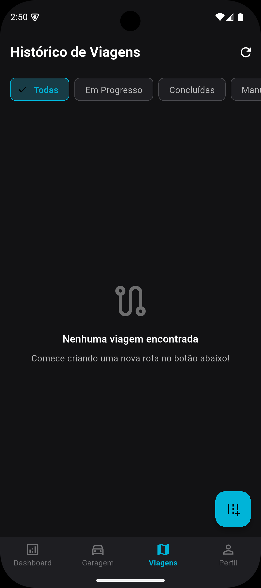&nbsp;&nbsp;&nbsp;&nbsp;
    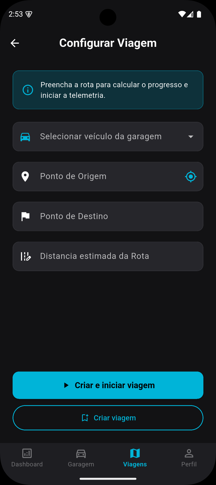&nbsp;&nbsp;&nbsp;&nbsp;
    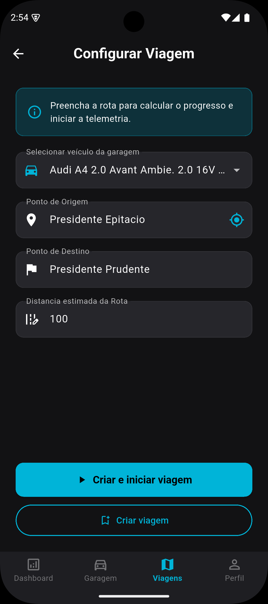&nbsp;&nbsp;&nbsp;&nbsp;
    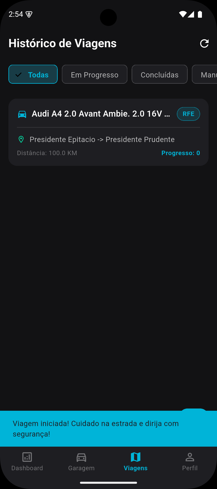&nbsp;&nbsp;&nbsp;&nbsp;
    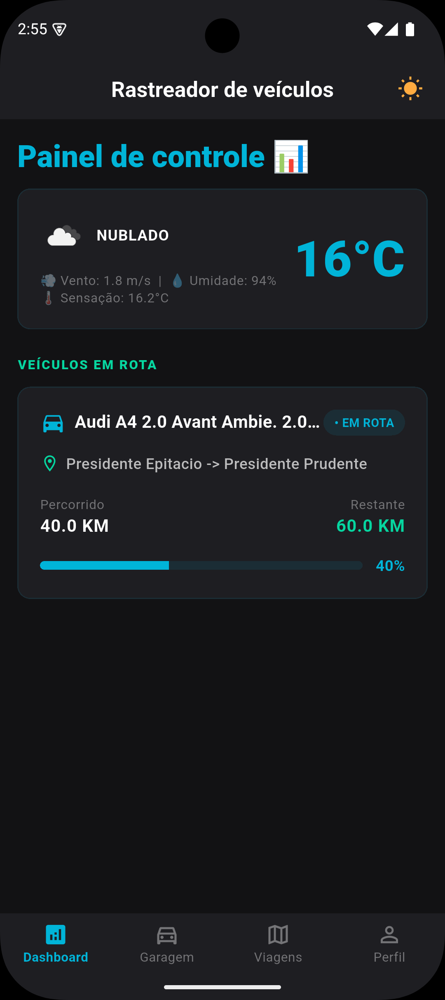&nbsp;&nbsp;&nbsp;&nbsp;
    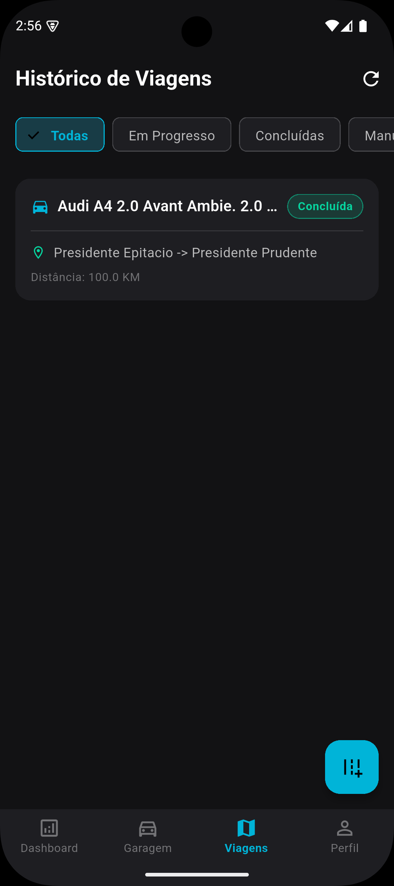&nbsp;&nbsp;&nbsp;&nbsp;
    </p>

   ***

6. **Logout**
   - **Descrição**: Ao pressionar na aba _Perfil_, na navegação do rodapé, veremos que a tela de perfil possui um ícone no canto superior direito da tela. Este ícone é o botão de logout, basta pressioná-lo que iremos sair do app e voltaremos para a tela de login.

   <p align="center">
   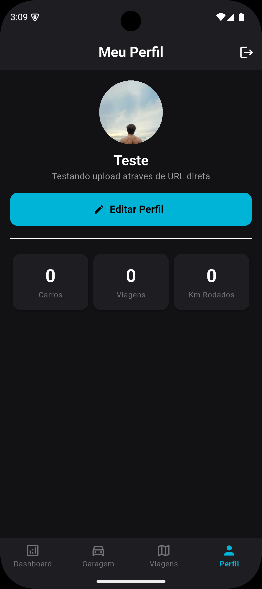&nbsp;&nbsp;&nbsp;&nbsp;
   &nbsp;&nbsp;&nbsp;&nbsp;
   </p>

## 📁 Estrutura de Pastas

- `android/` – configuração Android
- `ios/` – configuração iOS
- `lib/` – código Dart principal
- `assets/images/` – imagens do app e placeholders
- `test/` – testes automatizados

## 💡 Observações

- O app usa `WeatherFactory` com API de clima em português.
- A busca de veículo utiliza a API FIPE via `Dio`.
- A feature de foto de perfil permite upload usando câmera ou galeria.
