# 🚗 Vehicle Tracker

[](https://flutter.dev)
[](https://dart.dev)
[](https://firebase.google.com)
[](https://blog.cleancoder.com/uncle-bob/2012/08/13/the-clean-architecture.html)
[](https://pub.dev/packages/ionex)

**Vehicle Tracker** é um ecossistema completo para gerenciamento de frotas e controle de viagens, desenvolvido com Flutter e focado em uma experiência de usuário fluida, visualmente atraente e tecnicamente robusta. O projeto utiliza uma arquitetura modular escalável, integrando serviços de nuvem modernos e APIs externas.

---

## 📑 Índice

- [🚀 Visão Geral](#-visão-geral)
- [✨ Funcionalidades Principais](#-funcionalidades-principais)
- [🏗️ Arquitetura e Padrões](#-arquitetura-e-padrões)
- [🛠️ Pilha Tecnológica](#-pilha-tecnológica)
- [⚙️ Configuração e Instalação](#️-configuração-e-instalação)
- [🧪 Suíte de Testes](#-suíte-de-testes)
- [🖼️ Passo a passo por imagens](#️-passo-a-passo-por-imagens)

---

## 🚀 Visão Geral

O aplicativo permite que gestores e motoristas controlem veículos, planejem viagens com geolocalização em tempo real e monitorem condições climáticas.

**Destaques Técnicos:**

- **Integração FIPE:** Busca automatizada de marcas e modelos em tempo real.
- **Cloudflare R2:** Upload de mídia via Workers com URLs pré-assinadas para máxima performance e segurança.
- **Geolocator & Weather:** Preenchimento automático de dados geográficos e monitoramento climático por cidade.
- **Trip Engine:** Sistema de rastreamento de progresso de viagem com atualizações de status.

---

## ✨ Funcionalidades Principais

- **🛡️ Autenticação Segura:** Fluxo completo de login/cadastro via Firebase Auth.
- **📊 Dashboard Inteligente:** Resumo de viagens ativas e condições climáticas locais.
- **🚘 Garagem Virtual:** Cadastro detalhado de veículos com persistência no Firestore.
- **🛣️ Gestão de Viagens:** Criação de roteiros com cálculo de distância e seleção de frota.
- **👤 Perfil Customizável:** Edição de dados pessoais e upload de avatar (Câmera/Galeria/URL).
- **🌓 Temas Dinâmicos:** Suporte total a Light e Dark mode com transições suaves.

---

## 🏗️ Arquitetura e Padrões

O projeto foi construído seguindo os princípios da **Clean Architecture** e **SOLID**, garantindo baixo acoplamento e alta testabilidade.

### Organização de Pastas (`lib/src/`)

- `core/`: Componentes transversais como Injeção de Dependência (`get_it`), rotas (`go_router`), temas e serviços compartilhados.
- `features/`: Divisão por domínios de negócio (Auth, Garage, Trip, Dashboard, Profile).
  - `domain/`: Entidades, Casos de Uso e Contratos (Interfaces).
  - `data/`: Repositórios, Modelos (DTOs) e Data Sources.
  - `presentation/`: Páginas (UI), Widgets e Controllers.
  - `state/`: Definições de estado da funcionalidade.

### Gerenciamento de Estado

Utilizamos o **Ionex**, um gerenciador de estado reativo e leve que facilita a separação da lógica de negócio da UI através de Controllers robustos.

---

## 🛠️ Pilha Tecnológica

### Core

- **Framework:** [Flutter](https://flutter.dev) (Dart SDK >= 3.11.1)
- **State Management:** [Ionex](https://pub.dev/packages/ionex)
- **Dependency Injection:** [Get It](https://pub.dev/packages/get_it)
- **Navigation:** [GoRouter](https://pub.dev/packages/go_router)

### Backend & Storage

- **Auth & Database:** [Firebase](https://firebase.google.com) (Auth & Firestore)
- **Cloud Storage:** [Cloudflare R2](https://www.cloudflare.com/products/r2/) (via Cloudflare Workers)
- **API Client:** [Dio](https://pub.dev/packages/dio)

### Services

- **Weather:** [OpenWeather API](https://openweathermap.org/api)
- **Location:** [Geolocator](https://pub.dev/packages/geolocator) & [Geocoding](https://pub.dev/packages/geocoding)
- **Media:** [Image Picker](https://pub.dev/packages/image_picker)

---

## ⚙️ Configuração e Instalação

### Pré-requisitos

- Flutter SDK instalado.
- Conta no Firebase com um projeto configurado.

### 📦 Passo 1: Clone e Dependências

```bash
git clone https://github.com/BrenoLeiriaoNeto/vehicle_tracker.git
cd vehicle_tracker
flutter pub get
```

### 📦 Passo 2: Configuração Firebase

O app requer os arquivos de configuração do Firebase para funcionar:

- **Android:** `android/app/google-services.json`
- **iOS:** `ios/Runner/GoogleService-Info.plist`
- **Web:** Certifique-se de configurar `DefaultFirebaseOptions` em `lib/src/core/services/firebase_options.dart`.

### 📦 Passo 3: Execução

```bash
flutter run
```

---

## 🧪 Suíte de Testes

A qualidade do código é garantida por uma cobertura de testes abrangente, totalizando **mais de 100 testes**.

- **Testes Unitários:** Lógica de negócio e Casos de Uso.
- **Widget Tests:** Comportamento da UI e interações.
- **Mocks:** Uso intensivo de `mocktail`, `fake_cloud_firestore` e `firebase_auth_mocks`.

Para rodar os testes:

```bash
flutter test
```

---

## 🖼️ Passo a passo por imagens

Siga os passos abaixo para entender a navegação do App.

1. **Tela inicial**
   - **Descrição**: Primeira tela ao iniciar o app, permitindo fazer login em uma conta ja existente ou navegar para o formulário de criação de nova conta. Vamos pressionar o link _Cadastre-se_ no rodapé da tela para chegarmos na tela de criação de nova conta. Ao chegar na tela de criação, preencha os campos e pressione o botão _Cadastrar_. Isso irá criar sua conta e imediatamente logar você no sistema, navegando para a tela Dashboard.

   <p align="center">
    &nbsp;&nbsp;&nbsp;&nbsp;
    &nbsp;&nbsp;&nbsp;&nbsp;
    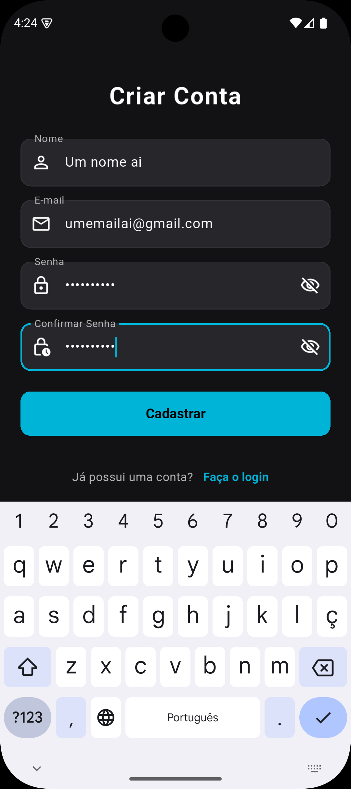&nbsp;&nbsp;&nbsp;&nbsp;
    &nbsp;&nbsp;&nbsp;&nbsp;
   </p>

   ***

2. **Dashboard com clima e viagem ativa**
   - **Descrição**: Esta é a nossa primeira tela do app. Aqui temos acesso a informações atuais do clima e uma listagem de viagens ativas no momento. A listagem de viagens será demonstrada em outra sessão. Também é possível ver a navegação de telas por uma barra no rodapé da tela, bem como trocar de temas dark e light no canto superior direito da tela, no ícone de sol.

   <p align="center">
   
   </p>

   ***

3. **Gerenciamento da garagem**
   - **Descrição**: Ao presionar na aba de _Garagem_, com ícone de carrinho, na barra de navegação do rodapé, iremos navegar para a tela de listagem de carros da aplicação. Ao clicar no botão `+` no canto inferior direito da tela, iremos navegar para a tela de adição de um novo veículo a garagem. Selecionamos primeiro a marca do veículo, depois selecionamos o modelo e então o ano/combustível. Preenchemos então a placa, a quiloemtragem atual do veículo e pressionamos o botão _Salvar veículo_ para adicionarmos a nossa garagem. Seremos então navegados de volta para a tela de listagem de veículos, agora com o novo veículo adicionado, basta usar o campo de pesquisa no topo da tela para pesquisar pelo veículo através de sua marca, modelo ou placa.
   - **Observação**: O aplicativo busca uma listagem externa da FIPE, então haverá marcas de veículos que podem não possuir modelos disponíveis para adicionar no app.

   <p align="center">
   &nbsp;&nbsp;&nbsp;&nbsp;
   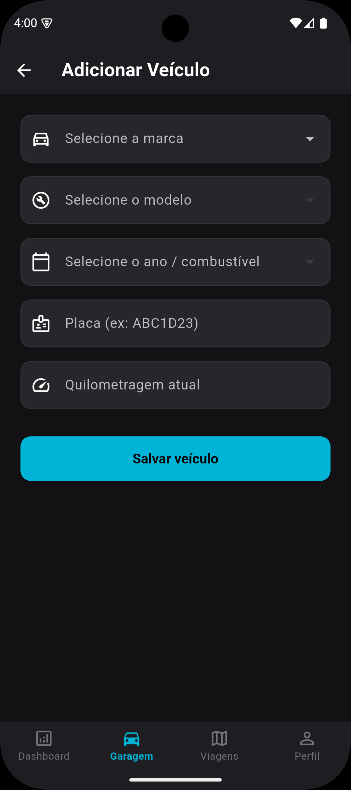&nbsp;&nbsp;&nbsp;&nbsp;
   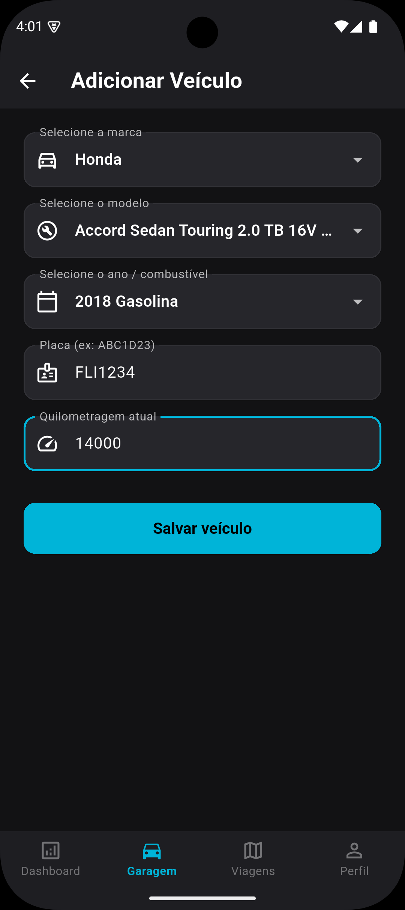&nbsp;&nbsp;&nbsp;&nbsp;
   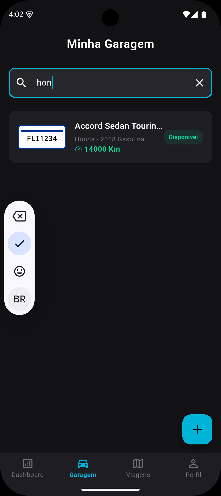&nbsp;&nbsp;&nbsp;&nbsp;
   </p>

   ***

4. **Gerenciamento de viagens**
   - **Descrição**: Ao pressionar na aba de _Viagens_, com ícone de mapa, na barra de navegação do rodapé, seremos navegados até a tela de listagem de viagens. Nesta tela, temos acesso aos filtros de viagem no topo da tela, botão de atualizar a lista no canto superior direito e o botão de configurar uma nova viagem, no canto inferiror direito. Vamos pressionar o botão de configurar uma nova viagem. Nesta nova tela, selecionamos um veículo disponível em nossa garagem, preenchemos o ponto de origem de forma manual ou com GPS, apenas pressionando no ícone a direita do campo de texto, preenchemos o ponto de destino, especificamos a distância estimada da viagem e pressionamos o botão _Criar e iniciar viagem_. Ao pressionar o botão, seremos levados de volta para a tela de listagem de viagem, agora listando a nossa nova viagem. Para vermos a viagem acontecendo, pressionamos na aba _Dashboard_, na navegação do rodapé, e podemos ver que agora a tela da Dashboard tem um card com informações sobre a viagem em progresso. A viagem atualiza o progresso a cada 5 segundos e, após finalizar, irá sumir da tela da Dashboard. Pressionamos novamente a aba _Viagens_, na navegação do rodapé, para voltarmos para a tela de listagem de viagens, pressionamos o botão de atualizar lista no canto superior direito, e vamos ter a nossa viagem com o status atualizado para _Concluída_. **OBS**: Pode ser necessário atualizar a tela de Dashboard, deslizando a tela para baixo, para conseguir enxergar a viagem em progresso.

   <p align="center">
    &nbsp;&nbsp;&nbsp;&nbsp;
    &nbsp;&nbsp;&nbsp;&nbsp;
    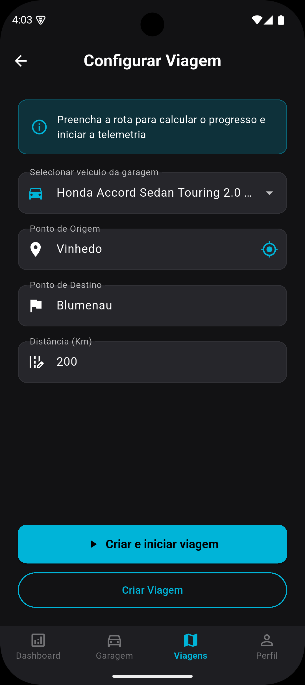&nbsp;&nbsp;&nbsp;&nbsp;
    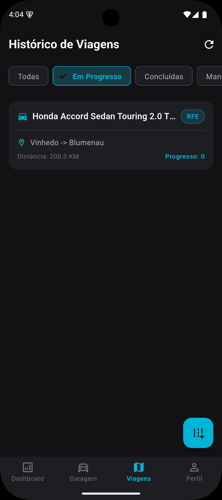&nbsp;&nbsp;&nbsp;&nbsp;
    &nbsp;&nbsp;&nbsp;&nbsp;
    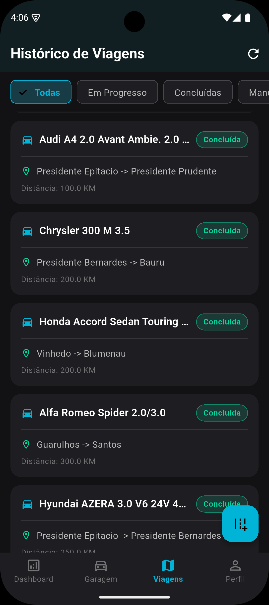&nbsp;&nbsp;&nbsp;&nbsp;
    </p>

   ***

5. **Tela de Perfil**
   - **Descrição**: Ao pressionar na aba de _Perfil_, com ícone de usuário, na barra de navegação do rodapé, seremos navegados para a tela de perfil do usuário. Na tela de perfil, podemos ver o avatar do usuário, função de edição de perfil e métricas do usuário no uso do app, que se resumem em Viagens completadas e Km Rodados, e o botão de logout no canto superior direito da tela. Ao pressionar no botão _Editar Perfil_, seremos levados a tela de edição do perfil. A edição de perfil será dividida em 3 subsessões, pois temos 3 formas diferentes de adicionarmos um novo avatar para o perfil, sendo eles: Câmera, Galeria e URL direta (suporte apenas aos formatos jpg, jpeg, png e svg).
     - **_Câmera_**: Na tela de edição de perfil, preencha o campo _Biografia_ com alguma informação sobre você e depois pressione o botão _Câmera_ para abrir a câmera do seu dispositivo para tirar uma foto (o app precisará da sua permissão para isso). Ao tirar a foto, aguarde até o avatar na tela de edição carregar a imagem e pressione o botão _Salvar Alterações_. Seremos levados devolta para a tela de perfil, agora com biografia e avatar atualizados.
      <p align="center">
         &nbsp;&nbsp;&nbsp;&nbsp;
         &nbsp;&nbsp;&nbsp;&nbsp;
         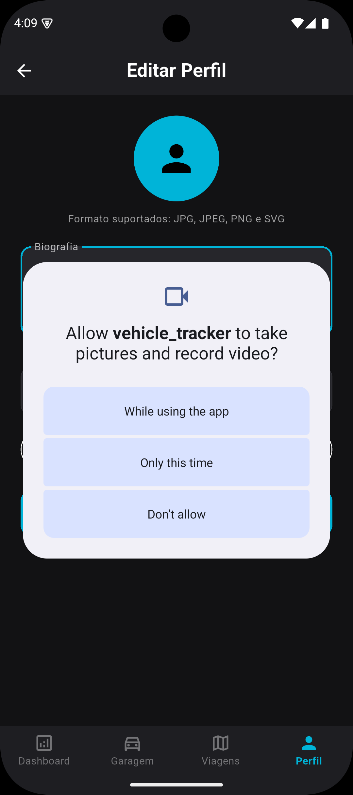&nbsp;&nbsp;&nbsp;&nbsp;
         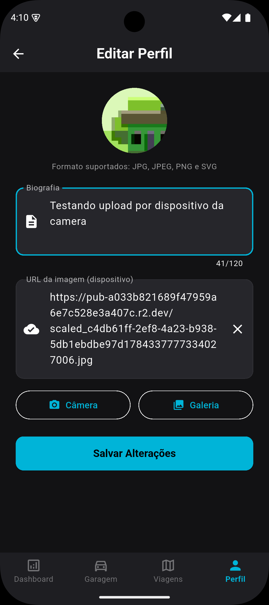&nbsp;&nbsp;&nbsp;&nbsp;
         &nbsp;&nbsp;&nbsp;&nbsp;
     </p>

     - _Galeria_: Na tela de edição de perfil, altere o campo _Biografia_ com alguma informação sobre você e depois pressione o botão _Galeria_ para abrir a galeria do seu dispositivo para selecionar uma imagem. Ao selecionar a imagem, aguarde até o avatar na tela de edição carregar a imagem e pressione o botão _Salvar Alterações_. Seremos levados devolta para a tela de perfil, agora com biografia e avatar atualizados.
      <p align="center">
         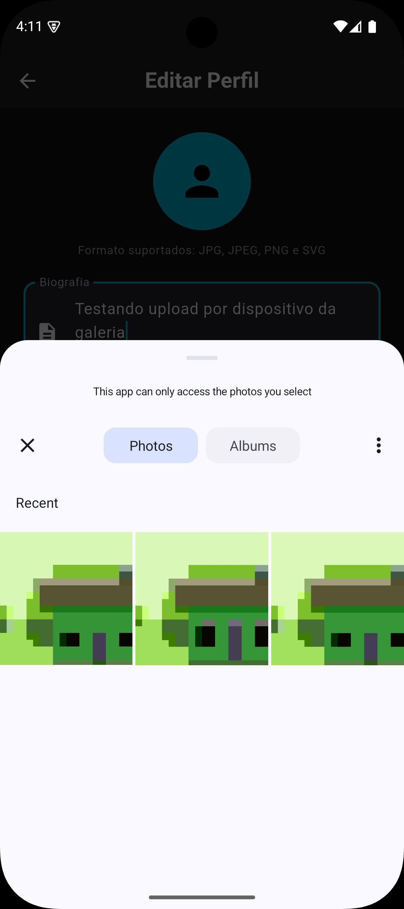&nbsp;&nbsp;&nbsp;&nbsp;
         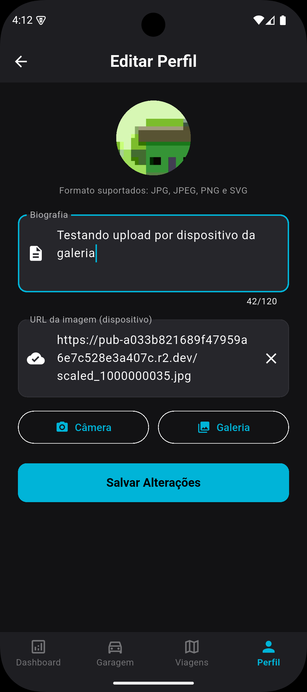&nbsp;&nbsp;&nbsp;&nbsp;
         &nbsp;&nbsp;&nbsp;&nbsp;
     </p>

     - _URL direta_: Na tela de edição de perfil, altere o campo _Biografia_ com alguma informação sobre você e depois preencha o campo _URL da imagem_ com alguma URL de imagem externa como: `https://picsum.photos/200/300.jpg`. Ao colar a URL da imagem, aguarde até o avatar na tela de edição carregar a imagem e pressione o botão _Salvar Alterações_. Seremos levados devolta para a tela de perfil, agora com biografia e avatar atualizados.
      <p align="center">
         &nbsp;&nbsp;&nbsp;&nbsp;
         &nbsp;&nbsp;&nbsp;&nbsp;
     </p>

     ***

6. **Logout**
   - **Descrição**: Ao pressionar na aba _Perfil_, na navegação do rodapé, veremos que a tela de perfil possui um ícone no canto superior direito da tela. Este ícone é o botão de logout, basta pressioná-lo que iremos sair do app e voltaremos para a tela de login.

   <p align="center">
   &nbsp;&nbsp;&nbsp;&nbsp;
   &nbsp;&nbsp;&nbsp;&nbsp;
   </p>

---

## 👤 Autor

Desenvolvido por **Breno Leirião Neto**.
